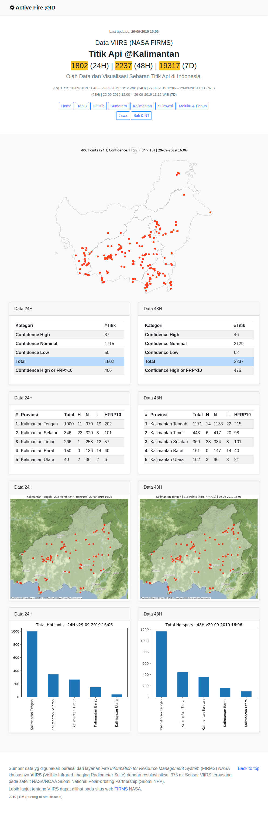

# Data Titik Api Indonesia 

Sumber data yg digunakan berasal dari layanan Fire Information for Resource Management System (FIRMS) NASA khususnya VIIRS (Visible Infrared Imaging Radiometer Suite) dengan resolusi piksel 375 m. Sensor VIIRS terpasang pada satelit NASA/NOAA Suomi National Polar-orbiting Partnership (Suomi NPP).

Lebih lanjut tentang VIIRS dapat dilihat pada situs web FIRMS NASA.

Raw data akan diperbaharui secara berkala, sesuai dengan data yg disediakan oleh [FIRMS](https://earthdata.nasa.gov/earth-observation-data/near-real-time/firms/viirs-i-band-active-fire-data).

## Akses Jupyter Notebook (Google Colab)

- [Seed Notebook 24H](https://colab.research.google.com/github/eueung/fireloc/blob/master/fireloc.ipynb)

## Update (17-12-2019 02:42)

## Web Render

Visualisasi lain dan hasil data post-processing dapat dilihat di [GitHub Pages](https://eueung.github.io/fireloc/).

## Lisensi

MIT